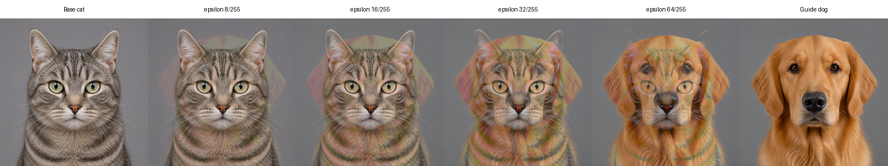

# Adversarial Image Attacks

This package creates a lossless PNG by moving a base image toward a guide
image while enforcing a per-channel L-infinity limit. The output is an
experimental candidate, not a guaranteed adversarial attack.

## Quick start

```bash
python3.11 -m venv .venv
source .venv/bin/activate
python -m pip install -e .

advmerge cat.jpg dog.png candidate.png \
  --strength 1 \
  --epsilon 8/255
```

The base image controls the output size. Output must be PNG so compression does
not change the perturbation. Existing files are preserved unless you pass
`--force`.

## Local UI and OpenAI evaluation

The optional UI requires Python 3.10 or later.

```bash
python -m pip install -e '.[ui]'
export OPENAI_API_KEY="your_api_key_here"
advmerge-ui
```

Open [http://127.0.0.1:7860](http://127.0.0.1:7860), upload a base and guide
image, and generate a candidate. Candidate generation stays local. Model
evaluation sends the base and candidate to OpenAI in two independent requests
using [`gpt-5.6-sol`](https://developers.openai.com/api/docs/models/gpt-5.6-sol).

For a targeted test, choose the target label before evaluation. A success
signal requires the base not to match the target and the candidate to match it.
API evaluation may incur charges. Never commit an API key.

## Method

```text
candidate = base + strength * (guide - base)
delta     = clip(candidate - base, -epsilon, epsilon)
output    = clip(base + delta, 0, 1)
```

`strength` controls movement toward the guide. `epsilon` sets the maximum
change to any RGB channel. The guide can be center-cropped with `cover` or
resized directly with `stretch`. Transparent images are composited over white
by default.

## Python API

```python
from PIL import Image
from adversarial_image_attacks import merge_images

with Image.open("cat.jpg") as base, Image.open("dog.png") as guide:
    candidate = merge_images(base, guide, epsilon=8 / 255)

candidate.save("candidate.png", format="PNG")
```

## Example result



In the included experiment, every PNG respected its requested pixel budget.
An isolated vision check kept the `cat` label through `32/255`. At `64/255`,
the label changed to `dog`, but the image was already a visible cat-dog
composite. This was a label-change signal, not a stealthy adversarial success.
It was not an official OpenAI API evaluation.

See the [full experiment](examples/generated/cat-to-dog/README.md) for prompts,
measurements, images, and reproduction steps.

## Limits and responsible use

Attack success depends on the model, preprocessing, prompt, objective, and
pixel budget. One changed response is not evidence of a reliable attack. The UI
tests multimodal vision behavior, not text-only language models.

Use this project only with images, models, and systems you own or are explicitly
authorized to test.
