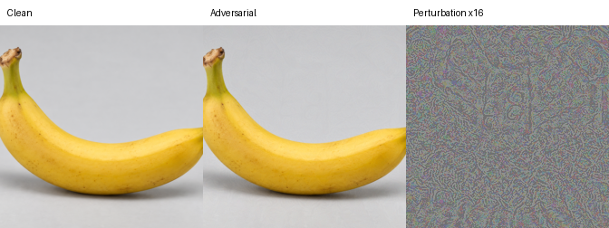
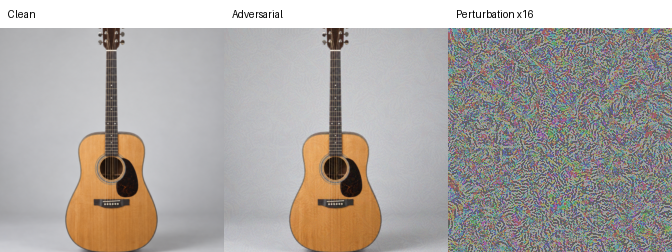
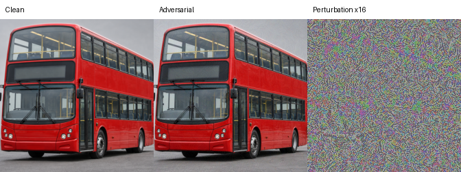

# Model-aware PGD examples

These examples use targeted PGD against torchvision ResNet-18 ImageNet-1K V1.
The attack changes model-input pixels directly and does not blend in a second
image.

| Image | Clean top-1 | Adversarial top-1 | Max change | PSNR | SSIM |
| --- | --- | --- | ---: | ---: | ---: |
| Banana | banana, 99.87% | toaster, 30.24% | 1/255 | 49.50 dB | 0.9914 |
| Guitar | acoustic guitar, 99.90% | golden retriever, 42.97% | 2/255 | 43.65 dB | 0.9656 |
| Bus | passenger car, 60.43% | banana, 19.81% | 2/255 | 43.49 dB | 0.9871 |

Every result was verified after uint8 quantization, PNG save, PNG reload, and
CPU inference. The left and middle panels below are clean and adversarial. The
right panel shows the signed perturbation amplified 16 times.







## Run

```bash
python -m pip install -e '.[attack]'

python examples/model-aware-pgd/run_attack.py \
  examples/model-aware-pgd/inputs/banana-generated.png \
  toaster \
  examples/model-aware-pgd/results/banana-to-toaster
```

The first run downloads the official ResNet-18 weights. Use `--checkpoint` for
an existing local checkpoint. The script tests `1/255`, `2/255`, `4/255`, and
`8/255`, then saves the smallest tested budget that succeeds in that run.
If every budget fails, it exits with status 1 and saves the best failed
candidate with an explicit `candidate` label.

The committed artifacts were generated on Apple MPS with seed `20260914`, 100
steps, and three restarts. Their saved predictions were also verified on CPU.

These are white-box results for one exact model and preprocessing pipeline.
They do not establish transfer to OpenAI models or other classifiers. The
images are visually subtle, but “imperceptible” would require a controlled
human study.
